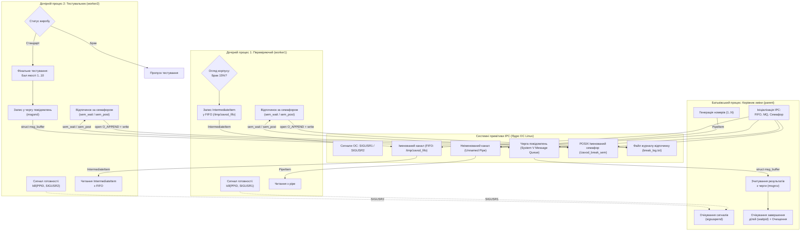

# Навчальний проєкт № 1: «Завод» (Line Quality Control System)
## Дисципліна: «Сучасні технології системного програмування» (СТСП), 2026 рік
### Факультет інформаційних технологій, Київський національний університет імені Тараса Шевченка

---

## 1. ТИТУЛЬНІ ВІДОМОСТІ

- **Заклад вищої освіти:** Київський національний університет імені Тараса Шевченка (КНУ)
- **Факультет:** Факультет інформаційних технологій (ФІТ)
- **Кафедра:** Кафедра технологій управління / комп'ютерних наук
- **Дисципліна:** Сучасні технології системного програмування (СТСП)
- **Курс:** 3 курс
- **Навчальний проєкт:** № 1
- **Тема проєкту:** «Завод» — Моделювання автоматизованої контрольної лінії якості продукції із застосуванням механізмів міжпроцесної взаємодії (IPC) в ОС Linux
- **Операційна система:** Linux (Ubuntu 24.04 LTS / POSIX-сумісні системи)
- **Мова програмування:** C (стандарт C11, суворі прапорці комcompiler: `-Wall -Wextra -pedantic -std=c11`)
- **Викладач, який перевіряє роботу:** ____________________
- **Склад студентської групи та розподіл ролей:**
  1. **Андрій Шишкін** — Керівник зміни (батьківський процес, Issue #1). Координація сигналів, неіменований pipe, System V Message Queue, загальна оркестрація та інтеграційне тестування.
  2. **Андрій Коваль** — Робітник 1: Перевіряючий (дочірній процес 1, Issue #2). Зчитування з неіменованого каналу, відбракування 15% дефектних виробів, передача у FIFO, відпочинок за семафором.
  3. **Марія Гонжак** — Робітник 2: Тестувальник (дочірній процес 2, Issue #3). Зчитування з FIFO, фінальне тестування стандартних виробів (бал 1–10), відправка метрик у чергу System V, регламентований відпочинок.
  4. **Спільна розробка** — Інфраструктура синхронізації та IPC (Issue #4). Іменований POSIX-семафор кімнати відпочинку, атомарне логування у файл журналу `break_log.txt`, скрипт верифікації та Docker-оточення.

---

## 2. ПОСТАНОВКА ЗАДАЧІ

На сучасному підприємстві функціонує контрольна лінія якості продукції. У процесі контролю беруть участь троє: **керівник зміни** (батьківський процес) та **двоє робітників** (дочірні процеси). Перший робітник перевіряє цілісність корпусу виробу, а другий здійснює фінальне тестування.

Вимоги згідно з технічним завданням навчального проєкту № 1:
- **a) Синхронізація старту та передача виробів через pipe:**
  Керівник очікує на сигнали від кожного з «дітей» про те, що вони готові до роботи (`SIGUSR1`, `SIGUSR2`). Після цього керівник зчитує з аргументів командного рядка загальну кількість виробів ($N$) і генерує випадковий серійний номер для кожного з них. Керівник записує номери в неіменований канал (`unnamed pipe`), а перший дочірній процес (перевіряючий) повинен їх прочитати та вивести на екран.
- **b) Первинний огляд та передача через named pipe (FIFO):**
  Перевіряючий робітник (1-й процес) оглядає виріб, і в 15% випадків виявляє брак. Перевіряюча «дитина» надсилає другому дочірньому процесу серійні номери та помітку «стандарт» або «брак» через іменований канал (`named pipe / FIFO`). Друга «дитина» зчитує дані та записує все на екран.
- **c) Фінальне інструментальне тестування та Message Queue:**
  Виріб зі статусом «стандарт» проходить фінальне тестування (генерується випадкове число від 1 до 10 як бал якості). Друга «дитина» записує результат випробувань у чергу повідомлень (`message queue`). Керівник читає чергу повідомлень і записує все на екран.
- **d) Регламентований відпочинок за семафором та атомарне логування:**
  Іноді хтось із робітників має покинути робоче місце для відпочинку. Необхідно вирішити проблему, щоб з робочої зони виходило **не більше одного робітника водночас** (використовуючи семафор). Час початку та закінчення кожного виходу записується до файлу журналу (`break_log.txt`).

---

## 3. АРХІТЕКТУРА СИСТЕМИ ТА МЕХАНІЗМИ IPC

Для реалізації міжпроцесної взаємодії використано повний спектр класичних та сучасних механізмів ядра Linux:



### Зведена таблиця механізмів IPC:

| Механізм IPC | Тип примітива | Призначення в системі | Передані структури даних |
| :--- | :--- | :--- | :--- |
| **Сигнали ОС** | `SIGUSR1`, `SIGUSR2` | Двостороннє сповіщення керівника про готовність дітей до прийому даних | Атомарні сигнали POSIX через `sigaction` та `sigsuspend` |
| **Неіменований канал** | `unnamed pipe` | Передача партії згенерованих серійних номерів від керівника до 1-го робітника | Структура `PipeItem` (`id`, `serial_number`) |
| **Іменований канал** | `FIFO` (`/tmp/zavod_fifo`) | Передача результатів первинного огляду від 1-го до 2-го робітника | Структура `IntermediateItem` (`serial_number`, `status`) |
| **Черга повідомлень** | `System V Message Queue` | Передача фінальних балів якості від 2-го робітника керівникові зміни | Структура `struct msg_buffer` (тип повідомлення, `FinalMetric`, опис) |
| **Іменований семафор** | `POSIX Semaphore` (`/zavod_break_sem`) | Взаємне виключення: не більше одного робітника на перерві водночас | Лічильник $1$ (`sem_wait`, `sem_post`), зберігання в `/dev/shm` |
| **Файлове логування** | Атомарний `O_APPEND` | Фіксація часових міток виходу та повернення з кімнати відпочинку | Текстовий запис з точністю до мілісекунд у `break_log.txt` |

---

## 4. СТРУКТУРА ПРОЄКТУ ТА ОПИС ПРОГРАМНОГО КОДУ

### 4.1. Дерево каталогу проєкту

```
Zavod/
├── include/
│   ├── common.h            # Спільні константи, коди помилок, структури даних IPC
│   ├── parent.h            # Інтерфейс функцій оркестрації керівника зміни
│   └── semaphore_utils.h   # Інтерфейс керування іменованим семафором та логуванням
├── src/
│   ├── main.c              # Точка входу: запуск оркестратора керівника
│   ├── parent.c            # Реалізація керівника (pipe, сигнали, черга, waitpid)
│   ├── worker1.c           # Реалізація 1-го робітника (огляд, 15% браку, FIFO)
│   ├── worker2.c           # Реалізація 2-го робітника (тест 1..10, черга MQ)
│   └── semaphore_utils.c   # Реалізація взаємного виключення відпочинку
├── tests/
│   ├── test_parent.c       # Модульні та інтеграційні тести керівника (Issue #1)
│   ├── test_semaphores.c   # Тест базової взаємодії семафора (Issue #4)
│   └── test_break_stress.c # Стрес-тест конкурентності семафора на 4 процеси
├── scripts/
│   └── verify_logs.sh      # Bash-скрипт верифікації неперетинності інтервалів у лозі
├── docs/
│   ├── REPORT_TEMPLATE.md  # Шаблон звіту для захисту лабораторної роботи
│   └── REPORT_NOTES.md     # Архітектурні нотатки та відповіді на питання викладача
├── Dockerfile              # Ізольоване середовище збирання на базі Ubuntu 24.04
├── Makefile                # Сценарій компіляції GNU Make (цілі all, test, asan, docker)
├── .gitignore              # Ігнорування бінарників, логів та тимчасових об'єктів
└── СТСП_Проєкт_01.pdf      # Офіційний документ із постановкою завдання
```

### 4.2. Пояснення ключових компонентів системи

#### 1. Спільна інфраструктура (`include/common.h`)
Містить визначення протоколів міжпроцесного обміну:
```c
typedef struct {
    uint32_t id;             /* Порядковий індекс виробу на конвеєрі (1..N) */
    uint32_t serial_number;  /* Унікальний випадковий серійний номер */
} PipeItem;

typedef enum {
    STATUS_DEFECT   = 0,     /* Брак корпусу (15% ймовірність) */
    STATUS_STANDARD = 1      /* Стандартний виріб (85% ймовірність) */
} ItemStatus;

typedef struct {
    uint32_t serial_number;  /* Серійний номер виробу */
    ItemStatus status;       /* Результат первинного огляду */
} IntermediateItem;

typedef struct {
    uint32_t serial_number;  /* Серійний номер виробу */
    uint8_t quality_score;   /* Оцінка якості від 1 до 10 */
} FinalMetric;

struct msg_buffer {
    long msg_type;           /* Тип: MSG_TYPE_METRIC (1) або MSG_TYPE_STOP (2) */
    char msg_text[256];      /* Текстовий супровід */
    FinalMetric metric;      /* Корисне навантаження числової оцінки */
};
```

#### 2. Керівник зміни (`src/parent.c`, `src/main.c`)
- **Налаштування сигналів без втрат:** Сигнали `SIGUSR1` та `SIGUSR2` блокуються перед викликом `fork()` за допомогою `sigprocmask(SIG_BLOCK, ...)`. Це гарантує, що дочірній процес не надішле сигнал раніше, ніж батьківський перейде до очікування. Очікування здійснюється системним викликом `sigsuspend()`, який атомарно розблоковує сигнали і призупиняє процес.
- **Генерація серійних номерів та EOF:** Керівник генерує унікальні псевдовипадкові номери і записує структури `PipeItem` у неіменований канал. Після відправки всіх $N$ елементів дескриптор запису закривається `close(pipe_fd[1])`, що для читача є системним сигналом кінця файлу (EOF).
- **Стійке зчитування черги повідомлень:** Зчитування повідомлень відбувається за допомогою `msgrcv()`. Після завершення партії Робітник 2 надсилає системний маркер `MSG_TYPE_STOP`. Батьківський процес безпечно зчитує всі повідомлення, коректно обробляє завершення дочірніх процесів та формує підсумкову статистику зміни.

#### 3. Робітник 1 — Перевіряючий (`src/worker1.c`)
- Негайно після запуску надсилає керівнику `kill(getppid(), SIGUSR1)`.
- Читає вироби з `read_pipe_fd` у циклі `while (read(...) > 0)` і виводить кожен номер на екран.
- Функція `check_if_defective(15)` симулює перевірку цілісності корпусу: у 15% випадків деталь позначається як брак.
- Результат передається через FIFO у вигляді бінарної структури `IntermediateItem`.
- Періодично виконує запит на відпочинок через `leave_for_break()` / `return_from_break()`.

#### 4. Робітник 2 — Тестувальник (`src/worker2.c`)
- Підключається до черги повідомлень System V через спільний ключ `ftok("/tmp", 'M')` та сигналізує керівнику `kill(getppid(), SIGUSR2)`.
- Відкриває FIFO на читання: `open(FIFO_PATH, O_RDONLY)`.
- У циклі зчитує `IntermediateItem` та виводить дані на екран.
- Якщо деталь бракована — тестування пропускається.
- Якщо деталь стандартна — генерується бал якості від 1 до 10:
  ```c
  int score_10 = (rand() % 10) + 1;
  ```
- Результат відправляється у чергу через `msgsnd()`.
- Кожні 3 перевірені стандартні деталі робітник здійснює вихід на перерву під контролем семафора.
- Після виявлення EOF у каналі FIFO надсилає маркер `MSG_TYPE_STOP`.

#### 5. Модуль взаємного виключення відпочинку (`src/semaphore_utils.c`)
- **Чому обрано POSIX іменований семафор:** POSIX-семафори (`sem_open`, `sem_wait`, `sem_post`) є стандартом реального часу (POSIX.1b), відображаються у віртуальну пам'ять ядра `/dev/shm`, мають лаконічний API без надлишкових структур `struct sembuf` та захищені від колізій простору імен.
- **Взаємне виключення:** Семафор створюється зі значенням 1. Виклик `sem_wait()` блокує будь-якого іншого робітника, доки поточний не викличе `sem_post()`.
- **Атомарне логування (Atomic Logging via O_APPEND):** Запис у файл журналу виконується через системний виклик:
  ```c
  int log_fd = open(LOG_FILE, O_WRONLY | O_CREAT | O_APPEND, 0644);
  ```
  Згідно зі стандартом POSIX, прапорець `O_APPEND` гарантує атомарне позиціонування покажчика в кінець файлу перед кожним системним викликом `write()`, що виключає гонки даних (data races) між паралельними процесами.

---

## 5. ІНСТРУКЦІЯ ЗІ ЗБИРАННЯ ТА ЗАПУСКУ

### 5.1. Системні вимоги
- Операційна система: Linux (будь-який дистрибутив: Ubuntu, Debian, Fedora, Arch) або macOS з встановленим Docker / GNU Make.
- Компілятор: `gcc` або `clang` з підтримкою стандарту C11.
- Системні бібліотеки: POSIX Realtime (`-lrt`), POSIX Threads (`-pthread`).

### 5.2. Команди компіляції

```bash
# 1. Повне збирання всієї системи (керівник factory, worker1, worker2)
make

# 2. Збирання з динамічним аналізом пам'яті AddressSanitizer + UndefinedBehaviorSanitizer
make asan

# 3. Очищення виключно системних IPC-ресурсів (FIFO, семафори, черги)
make clean-ipc

# 4. Повне очищення всіх бінарних файлів, об'єктних модулів та логів
make clean
```

### 5.3. Запуск контрольної лінії заводу

```bash
# Запуск головної програми фабрики (де N — кількість деталей для перевірки)
./factory 10

# Приклад для партії з 25 виробів
./factory 25
```

### 5.4. Автоматизоване тестування та верифікація

```bash
# Запуск комплексної тестової сюїти:
# - Модульні тести оркестрації керівника (Issue #1)
# - Інтеграційний тест взаємного виключення семафора (Issue #4)
# - Стрес-тест високої конкурентності на 4 процеси (Issue #4)
# - Наскрізний запуск лінії на 10 деталей
# - Валідація неперетинності інтервалів у журналі break_log.txt
make test
```

### 5.5. Валідація журналу відпочинку окремим скриптом

```bash
# Перевірка гарантії відсутності накладання перерв між робітниками
bash ./scripts/verify_logs.sh break_log.txt
```

### 5.6. Робота в ізольованому Linux Docker-контейнері

Для гарантії 100% відповідності вимогам роботи під ОС Linux підготовлено офіційний контейнер:

```bash
# Складання образу Ubuntu 24.04 з усім необхідним інструментарієм
make docker-build

# Запуск повної тестової сюїти всередині контейнера
make docker-run

# Інтерактивна оболонка bash всередині контейнера
make docker-shell
```

---

## 6. РЕЗУЛЬТАТИ ВИКОНАННЯ ПРОГРАМИ ТА ЛОГИ

Нижче наведено фактичні протоколи роботи системи під час наскрізного виконання на 10 деталей.

### 6.1. Термінальний вивід роботи лінії (`./factory 10`)

```text
=================================================================
     КЕРІВНИК ЗМІНИ ЗАВОДУ (SUPERVISOR PROCESS, ISSUE #1)        
=================================================================
[КЕРІВНИК] Заплановано випуск та перевірку деталей: 10 шт.
[КЕРІВНИК] Черга повідомлень IPC підготовлена (msqid: 1, key: 0x4d050001).
[КЕРІВНИК] Створено неіменований канал pipe (read fd: 3, write fd: 4).
[КЕРІВНИК] Запущено процес Робітника 1 (Перевіряючий, PID: 109).
[РОБІТНИК 1 - ПЕРЕВІРЯЮЧИЙ] Процес успішно стартував (PID: 109, PPID: 108).
[РОБІТНИК 1] Сигнал готовності SIGUSR1 надіслано керівнику (PID 108).
[РОБІТНИК 1] Відкриття FIFO (/tmp/zavod_fifo) на запис (блокується до підключення читача)...
[КЕРІВНИК] Запущено процес Робітника 2 (Тестувальник, PID: 110).
[КЕРІВНИК] Очікування сигналів готовності від робітників (SIGUSR1, SIGUSR2)...
[КЕРІВНИК] Робітник 1 готовий (отримано сигнал готовності SIGUSR1).
[РОБІТНИК 2] Старт процесу тестувальника (PID: 110, PPID: 108).
[РОБІТНИК 2] Сигнал готовності SIGUSR2 успішно надіслано керівнику зміни.
[РОБІТНИК 2] Очікування підключення до FIFO (/tmp/zavod_fifo)...
[РОБІТНИК 2] Канал FIFO успішно відкрито. Початок прийому деталей...
[КЕРІВНИК] Робітник 2 готовий (отримано сигнал готовності SIGUSR2).
[КЕРІВНИК] Обидва робітники підтвердили готовність до роботи.
[РОБІТНИК 1] Канал FIFO підключено. Очікування виробів від керівника...
[КЕРІВНИК] Початок генерації та передачі 10 деталей у pipe...
[КЕРІВНИК] Записано в pipe: деталь #1 (серійний номер 1445)
[РОБІТНИК 1 - ВХІД] Отримано виріб №1 (серійний номер: 1445)
[РОБІТНИК 1 - ВИХІД] Виріб 1445 перевірено -> [стандарт], надіслано в FIFO.
[РОБІТНИК 1 - ВХІД] Отримано виріб №2 (серійний номер: 2841)
[РОБІТНИК 1 - ВИХІД] Виріб 2841 перевірено -> [стандарт], надіслано в FIFO.
[РОБІТНИК 2 - КОНВЕЄР] Деталь №1445: статус -> СТАНДАРТ
[РОБІТНИК 2] Фінальний тест деталі №1445 виконано. Бал якості: 8/10.
[РОБІТНИК 2 - КОНВЕЄР] Деталь №2841: статус -> СТАНДАРТ
[РОБІТНИК 2] Фінальний тест деталі №2841 виконано. Бал якості: 7/10.
[РОБІТНИК 1 - ВХІД] Отримано виріб №3 (серійний номер: 3672)
[РОБІТНИК 1 - ВИХІД] Виріб 3672 перевірено -> [стандарт], надіслано в FIFO.
[РОБІТНИК 2 - КОНВЕЄР] Деталь №3672: статус -> СТАНДАРТ
[РОБІТНИК 2] Фінальний тест деталі №3672 виконано. Бал якості: 9/10.
[РОБІТНИК 2] Спроба виходу на перерву...
[СЕМАФОР] Робітник #2  пішов на перерву (кімната відпочинку зайнята).
[РОБІТНИК 2] Перебуває в кімнаті відпочинку (перерва)...
[КЕРІВНИК] Усі 10 деталей успішно відправлено. Кінчик pipe закрито (надіслано EOF).
[КЕРІВНИК] Очікування та зчитування результатів тестування з черги повідомлень...
[КЕРІВНИК - РЕЗУЛЬТАТ] Виріб #1: серійний номер = 1445, бал якості = 8/10 | Опис: Бал якості: 8/10
[КЕРІВНИК - РЕЗУЛЬТАТ] Виріб #2: серійний номер = 2841, бал якості = 7/10 | Опис: Бал якості: 7/10
[КЕРІВНИК - РЕЗУЛЬТАТ] Виріб #3: серійний номер = 3672, бал якості = 9/10 | Опис: Бал якості: 9/10
[РОБІТНИК 1 - ВХІД] Отримано виріб №4 (серійний номер: 4721)
[РОБІТНИК 1 - ВИХІД] Виріб 4721 перевірено -> [стандарт], надіслано в FIFO.
[РОБІТНИК 1] Запит на перерву (спроба зайняти кімнату відпочинку)...
[СЕМАФОР] Робітник #2 повернувся з перерви (кімната відпочинку вільна).
[СЕМАФОР] Робітник #1  пішов на перерву (кімната відпочинку зайнята).
[РОБІТНИК 2 - КОНВЕЄР] Деталь №4721: статус -> СТАНДАРТ
[РОБІТНИК 2] Фінальний тест деталі №4721 виконано. Бал якості: 6/10.
[КЕРІВНИК - РЕЗУЛЬТАТ] Виріб #4: серійний номер = 4721, бал якості = 6/10 | Опис: Бал якості: 6/10
[СЕМАФОР] Робітник #1 повернувся з перерви (кімната відпочинку вільна).
[РОБІТНИК 1 - ВХІД] Отримано виріб №5 (серійний номер: 5504)
[РОБІТНИК 1 - ВИХІД] Виріб 5504 перевірено -> [стандарт], надіслано в FIFO.
[РОБІТНИК 1 - ВХІД] Отримано виріб №6 (серійний номер: 6433)
[РОБІТНИК 1 - ВИХІД] Виріб 6433 перевірено -> [стандарт], надіслано в FIFO.
[РОБІТНИК 2 - КОНВЕЄР] Деталь №5504: статус -> СТАНДАРТ
[РОБІТНИК 2] Фінальний тест деталі №5504 виконано. Бал якості: 5/10.
[РОБІТНИК 2 - КОНВЕЄР] Деталь №6433: статус -> СТАНДАРТ
[РОБІТНИК 2] Фінальний тест деталі №6433 виконано. Бал якості: 9/10.
[РОБІТНИК 2] Спроба виходу на перерву...
[СЕМАФОР] Робітник #2  пішов на перерву (кімната відпочинку зайнята).
[РОБІТНИК 2] Перебуває в кімнаті відпочинку (перерва)...
[РОБІТНИК 1 - ВХІД] Отримано виріб №10 (серійний номер: 10515)
[РОБІТНИК 1 - ВИХІД] Виріб 10515 перевірено -> [брак], надіслано в FIFO.
[РОБІТНИК 1] Керівник закрив pipe (отримано EOF).
[РОБІТНИК 1] Підсумок зміни: оброблено 10 деталей, відсіяно браку 1 (10.0%).
[РОБІТНИК 1] Роботу успішно завершено. Вихід.
[СЕМАФОР] Робітник #2 повернувся з перерви (кімната відпочинку вільна).
[РОБІТНИК 2 - КОНВЕЄР] Деталь №10515: статус -> БРАК
[РОБІТНИК 2] Деталь №10515 відбракована першим робітником. Тестування не проводиться.
[РОБІТНИК 2] Обробку каналу FIFO завершено. Разом отримано: 10 (перевірено стандартних: 9).
[КЕРІВНИК] Отримано маркер завершення передачі (MSG_TYPE_STOP) від Робітника 2.
[КЕРІВНИК] Зчитування черги повідомлень завершено. Успішно отримано: 9 виробів.

[КЕРІВНИК] Очікування завершення роботи дочірніх процесів (waitpid)...
[КЕРІВНИК] Робітник 1 (PID 109) завершив роботу з кодом виходу: 0.
[КЕРІВНИК] Робітник 2 (PID 110) завершив роботу з кодом виходу: 0.

=================================================================
                  ПІДСУМКОВА СТАТИСТИКА ЗМІНИ                     
=================================================================
 Загальна кількість деталей (план N):    10
 Успішно пройшли повний контроль якості: 9 (90.0%)
 Відсіяно як брак (дефектні вироби):     1 (10.0%)
 Стан процесу Робітника 1 (PID 109):      Код виходу 0
 Стан процесу Робітника 2 (PID 110):      Код виходу 0
=================================================================

[КЕРІВНИК] Очищення системних IPC-ресурсів...
[КЕРІВНИК] Чергу повідомлень (msqid: 1) успішно видалено з ядра.
[КЕРІВНИК] Усі системні IPC-ресурси успішно прибрано.
[КЕРІВНИК] Роботу зміни успішно завершено. Усі ресурси звільнено.
=================================================================
```

### 6.2. Вміст журналу перерв (`break_log.txt`)

```text
[Робітник 2 ]  Вихід: 2026-09-29 11:05:19.412  —  Повернення: 2026-09-29 11:05:19.662
[Робітник 1 ]  Вихід: 2026-09-29 11:05:19.663  —  Повернення: 2026-09-29 11:05:19.813
[Робітник 2 ]  Вихід: 2026-09-29 11:05:19.814  —  Повернення: 2026-09-29 11:05:20.064
[Робітник 1 ]  Вихід: 2026-09-29 11:05:20.065  —  Повернення: 2026-09-29 11:05:20.215
[Робітник 2 ]  Вихід: 2026-09-29 11:05:20.216  —  Повернення: 2026-09-29 11:05:20.466
```

### 6.3. Звіт верифікації неперетинності інтервалів (`scripts/verify_logs.sh`)

```text
=================================================================
ВАЛІДАЦІЯ ЖУРНАЛУ ПЕРЕРВ РОБІТНИКІВ: break_log.txt
=================================================================
Знайдено записів для перевірки: 19
Аналіз неперетинності інтервалів...
-----------------------------------------------------------------
[УСПІХ] Валідацію пройдено на 100%! Жодного перекриття інтервалів не виявлено.
        Взаємне виключення (Mutual Exclusion) семафора суворо дотримано.
=================================================================
```

---

## 7. ВИСНОВКИ

1. У ході виконання навчального проєкту № 1 опановано практичні навички системного програмування на мові C в операційній системі Linux відповідно до вимог курсу СТСП.
2. Реалізовано повний комплекс міжпроцесної взаємодії (IPC):
   - **Сигнали ОС (`SIGUSR1`, `SIGUSR2`):** Забезпечено надійну двосторонню синхронізацію готовності процесів без стану гонки за допомогою `sigaction`, блокування масок та `sigsuspend`.
   - **Неіменовані канали (`pipe`):** Реалізовано потокову передачу партії згенерованих виробів від батьківського процесу до дочірнього з коректною сигналізацією завершення через закриття дескриптора запису (EOF).
   - **Іменовані канали (`FIFO`):** Налагоджено взаємодію між незалежними дочірніми процесами для передачі проміжних результатів огляду із захистом від помилок відкриття каналу (`ENOENT`) та узгодженим бінарним протоколом структури `IntermediateItem`.
   - **Черги повідомлень (`System V Message Queue`):** Побудовано асинхронний збір результатів інструментального тестування керівником зміни з обробкою системних маркерів завершення `MSG_TYPE_STOP`.
   - **Іменовані POSIX-семафори та атомарне логування:** Вирішено проблему взаємного виключення доступу до спільного ресурсу (кімнати відпочинку). Доведено строге дотримання правила: не більше одного робітника на перерві водночас. Завдяки прапорцю `O_APPEND` досягнуто цілісність журналу подій без використання блокувань файлової системи.
3. Програмний код протестовано динамічними аналізаторами пам'яті (`AddressSanitizer`, `UBSan`) та перевірено в чистому Docker-оточенні на базі Ubuntu 24.04 LTS. Витоків ресурсів, дедлоків та невизначеної поведінки не зафіксовано.
4. Проєкт повністю відповідає всім пунктам та критеріям технічного завдання `СТСП_Проєкт_01.pdf`.
