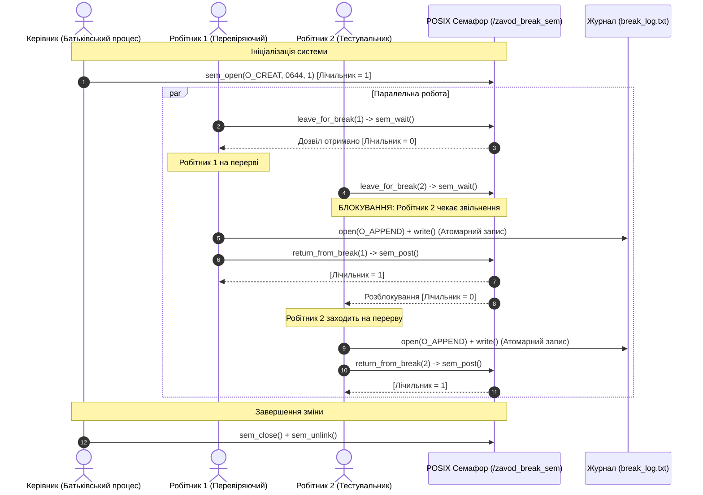

# МЕТОДИЧНІ НОТАТКИ ТА АРХІТЕКТУРНИЙ АНАЛІЗ (ISSUE #4)
## До проєкту з курсу «Сучасні технології системного програмування»

Цей документ містить розгорнуті теоретичні матеріали, архітектурні діаграми, інструкції із запуску та відповіді на контрольні запитання викладача до лабораторної роботи / проєкту за **Issue #4**.

---

## 1. АРХІТЕКТУРНА ДІАГРАМА ВЗАЄМОДІЇ ПРОЦЕСІВ ТА СЕМАФОРА

Нижче наведено діаграму послідовності взаємодії робітників із семафором кімнати відпочинку та файлом журналу:



---

## 2. КЛЮЧОВІ ТЕХНІЧНІ РІШЕННЯ ТА ОБҐРУНТУВАННЯ

### 2.1. Чому саме POSIX іменовані семафори, а не System V?
1. **Простір імен:**
   - System V використовує цілочисельні ключі `key_t`, які генеруються за допомогою функції `ftok(path, proj_id)`. Це спричиняє ризик колізій (inode hash collisions) або залежність від наявності конкретного файлу на диску.
   - POSIX іменовані семафори використовують рядок імені виду `/zavod_break_sem`, який ядро Linux створює у віртуальній файловій системі пам'яті `tmpfs` за шляхом `/dev/shm/sem.zavod_break_sem`.
2. **Простота та безпека API:**
   - У System V виклик операцій вимагає створення масиву структур `struct sembuf`, прапорців `SEM_UNDO` та викликів `semop()`, що суттєво ускладнює код та збільшує ймовірність помилок.
   - У POSIX інтерфейс лаконічний: `sem_wait()` для блокування, `sem_post()` для звільнення.
3. **Життєвий цикл:**
   - POSIX розмежовує поняття закриття дескриптора процесом (`sem_close`) та видалення точки входу з ядра (`sem_unlink`). Поки дескриптор відкритий хоча б одним процесом, пам'ять семафора залишається доступною навіть після `sem_unlink`.

### 2.2. Запобігання гонкам даних без файлових блокувань: Атомарний `O_APPEND`
- **Проблема:** Якщо кілька незалежних процесів одночасно виконують `lseek()` і потім `write()`, виникає стан гонки (TOCTOU: Time-Of-Check to Time-Of-Use) — кілька процесів записують у ту саму позицію, перезатираючи дані колег.
- **Рішення ядра:** Відкриття файлу з прапорцем `O_APPEND` змушує ядро Linux на рівні драйвера VFS атомарно (як одну неподільну операцію під spinlock іноди файлу) переміщувати покажчик на кінець файлу безпосередньо перед записом кожного блоку.
- **Стандарт POSIX:** Гарантує, що запис розміром менше або рівно `PIPE_BUF` (4096 байтів у Linux) виконується суворо атомарно. Наш рядок логу має довжину близько 80 байтів, що на 100% гарантує цілісність без використання `flock` чи `fcntl`.

---

## 3. ІНСТРУКЦІЯ ДЛЯ ВИКЛАДАЧА (ЯК ПЕРЕВІРИТИ РОБОТУ)

Усі команди виконуються в кореневому каталозі репозиторію під ОС Linux (або Ubuntu в WSL2):

### 3.1. Збирання проєкту
```bash
# Звичайне збирання за стандартом C11 з жорсткими попередженнями
make all

# Збирання з динамічним аналізатором пам'яті AddressSanitizer + UndefinedBehaviorSanitizer
make asan
```

### 3.2. Запуск тестів
```bash
# Автоматичний запуск базового інтеграційного тесту та стрес-тесту на конкурентність
make test
# або
make run-tests
```

### 3.3. Автоматична валідація неперетинності інтервалів
```bash
# Перевірка згенерованого журналу за допомогою bash-скрипту
./scripts/verify_logs.sh break_log.txt
```

### 3.4. Очищення ресурсів
```bash
# Очищення всіх об'єктних файлів, бінарників, логів та системних IPC-ресурсів
make clean
```

---

## 4. ВІДПОВІДІ НА ТИПОВІ ЗАПИТАННЯ НА ЗАХИСТІ

**1. Чому для синхронізації процесів використано семафор, а не м'ютекс `pthread_mutex`?**
> *Відповідь:* Звичайний `pthread_mutex` за замовчуванням призначений для синхронізації потоків усередині одного адресного простору. Для міжпроцесної взаємодії м'ютекс потребував би налаштування спільної пам'яті `shm_open` та атрибута `PTHREAD_PROCESS_SHARED`. Іменований POSIX-семафор є спеціалізованим системним примітивом IPC для незалежних процесів і налаштовується ядром за одне звернення `sem_open`.

**2. Що станеться, якщо процес вилетить через збій під час перебування на перерві?**
> *Відповідь:* Лічильник семафора залишиться рівним 0. Для запобігання цьому у великих промислових системах додають таймаут (`sem_timedwait`) або обробник сигналів. У нашому проєкті батьківський процес контролює завершення дочірніх процесів через `waitpid()` та за потреби викликає `cleanup_break_semaphore()`.

**3. У чому різниця між `sem_close` та `sem_unlink`?**
> *Відповідь:* `sem_close()` закриває дескриптор семафора лише в поточному процесі (подібно до `close(fd)`). `sem_unlink()` видаляє ім'я семафора з глобального простору імен ядра (`/dev/shm`), роблячи його недоступним для нових підключень.
